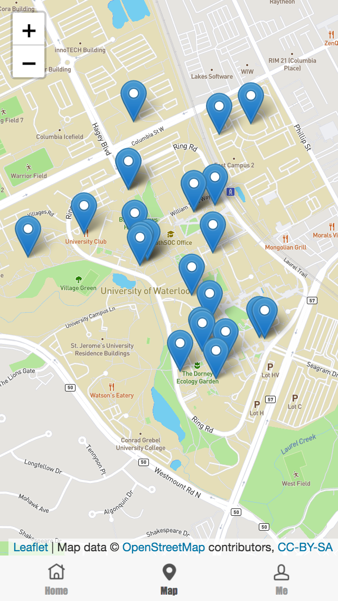

# uw_foodie_front_end

### Building filter, Time filter, Sort by name, Sort by closingTime


```
uw_foodie_front_end
└───uwfoodie_webapp: React front end
│   │   dist: builded html
└───uwfoodie_server: Express test back end
```

You can just open `uwfoodie_webapp/dist/index.html` to preview.

### map



### home


### home_where


### home_when


### home_sort


### home_detail


### home_comment


### map


### me

